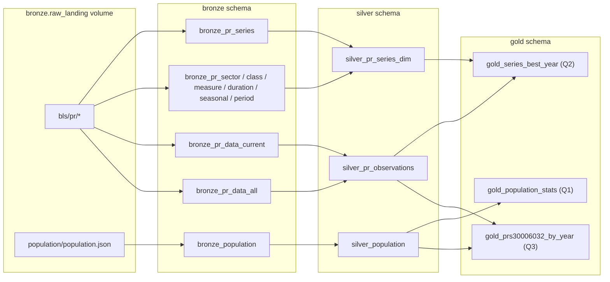

# Bronze / Silver / Gold Declarative Pipeline - Design Doc

This documents the design and implementation of Step 2 of the assignment: modeling
the BLS productivity + Data USA population data as a Lakeflow (Spark) Declarative
Pipeline with Bronze, Silver, and Gold tables, data quality expectations, and the
three required Gold questions implemented once in SQL and once in PySpark.

## Key facts gathered from the source files

- **`pr.series`** (283 rows): `series_id, sector_code, class_code, measure_code,
  duration_code, seasonal, base_year, footnote_codes, begin_year, begin_period,
  end_year, end_period`. There is no human-readable title column - one has to be
  built from the lookup files.
- **`pr.data.0.Current`** / **`pr.data.1.AllData`**: `series_id, year, period,
  value, footnote_codes`. The two files overlap in coverage; `Current` holds the
  freshest values for the in-progress year, `AllData` is the full history.
- **Lookup/mapping files** (small, one row per code): `pr.sector` (sector_code ->
  sector_name), `pr.class` (class_code -> class_text), `pr.measure` (measure_code
  -> measure_text), `pr.duration` (duration_code -> duration_text), `pr.seasonal`
  (seasonal_code -> seasonal_text), `pr.period` (period -> period_name),
  `pr.footnote` (footnote_code -> footnote_text).
- **`pr.txt`** Sections 3 and 7 explicitly document `period` values `Q01`-`Q04` as
  quarters and `Q05` as a separate **Annual Average** aggregate. This directly
  determines how Gold question 2 is computed (see below).
- **`pr.contacts`** is free text (phone/email), not tabular data - excluded from
  Bronze modeling entirely.
- All BLS files are tab-separated ASCII with space-padded fixed-width values
  (e.g. `"PRS30006011      \t1995\tQ01\t         2.6\t"`), which requires
  `sep="\t"` plus `ignoreLeadingWhiteSpace`/`ignoreTrailingWhiteSpace`, and an
  explicit schema (header casing is inconsistent - e.g. `pr.seasonal` uses
  `Seasonal_code`/`Seasonal_text`).
- The Data USA population API returns a single JSON object (not JSON-lines) with
  `data: [{"Nation ID", "Nation", "Year", "Population"}, ...]`. Years present:
  2013-2019, 2021-2024 - 2020 is missing because ACS didn't publish a 1-year
  estimate that year (a known, real-world gap, not a data quality bug). 2013-2018
  is fully contiguous, so Gold question 1 is unaffected.

## Documented design decisions / assumptions

1. **Gold question 2's "sum across quarters" = `period IN ('Q01','Q02','Q03','Q04')`**,
   excluding `Q05`. BLS's own documentation defines `Q05` as "Annual Average," a
   separately computed aggregate rather than a fifth quarter - including it would
   double-count each year's total instead of summing "across quarters" as asked.
2. **Standard deviation (Gold question 1) = sample stddev** (`STDDEV` /
   `STDDEV_SAMP`, Spark's default, divide by N-1). This is a convention choice,
   not derivable from the source data - swap to `STDDEV_POP` in
   `gold_population_stats.sql` / the PySpark alternate if population stddev
   (divide by N) is intended instead.
3. **Bronze/Silver/Gold are materialized views (full batch recompute), not
   streaming tables.** The raw files are small (largest ~3 MB) and get
   *overwritten in place* by the ingestion job rather than incrementally
   appended - a poor fit for Auto Loader's new-file-arrival model, which would
   need `cloudFiles.allowOverwrites` plus careful checkpoint handling for
   something that doesn't need incrementality. A `@dp.table` that fully reads the
   volume on every pipeline update is simpler, always correct, and trivially
   cheap at this data size. Expectations also force a full refresh on
   materialized views regardless, so there's no incremental-processing benefit
   being given up by this choice.
4. **SQL is the primary implementation for all three Gold tables; PySpark is the
   documented alternate**, kept in `transformations/gold_alternates/` (a
   sibling of `transformations/gold/`, not nested inside it) so the pipeline's
   `gold/**` library glob never picks it up. This is a style choice made to
   keep the write-up consistent - functionally the two are equivalent, and
   flipping which one is "primary" is a one-line change to
   `resources/bls_pipeline.yml`.
5. **`pr.data.0.Current` wins over `pr.data.1.AllData`** when both have a row for
   the same `(series_id, year, period)`, since `Current` reflects the latest
   revision for the in-progress year.

## Repository structure

```
databricks.yml                          bundle root: variables, targets
resources/
  ingestion_job.yml                     job: setup -> [ingest_bls_pr, ingest_population] -> refresh_bls_pipeline
  bls_pipeline.yml                      Lakeflow Declarative Pipeline resource (serverless, multi-schema publish)
setup/                                  01_create_catalog_schemas_volume.py (unchanged)
ingestion/                              02_ingest_bls_pr.py, 03_ingest_population.py, _manifest_common.py (unchanged)
transformations/
  bronze/
    bronze_pr_series.py                 bronze_pr_series
    bronze_pr_reference_data.py         bronze_pr_sector/class/measure/duration/seasonal/period/footnote
    bronze_pr_data.py                   bronze_pr_data_current, bronze_pr_data_all
    bronze_population.py                bronze_population
  silver/
    silver_pr_series_dim.py             decoded codes + synthesized series_label
    silver_pr_observations.py           unioned + deduped + typed pr.data
    silver_population.py                cleaned population records
  gold/
    gold_population_stats.sql           Q1 (SQL primary)
    gold_series_best_year.sql           Q2 (SQL primary)
    gold_prs30006032_by_year.sql        Q3 (SQL primary)
    alternates/
      gold_population_stats_pyspark.py       Q1 (PySpark alternate, not wired in)
      gold_series_best_year_pyspark.py       Q2 (PySpark alternate, not wired in)
      gold_prs30006032_by_year_pyspark.py    Q3 (PySpark alternate, not wired in)
      README.md                              explains why/how these are excluded
```

## Pipeline DAG



## Bronze layer

One materialized view per raw file. Each declares an explicit `StructType`
schema (satisfies "expected schema") and an `@dp.expect_or_drop` constraint on
its key column(s) (satisfies "non-null keys"):

| Table | Source file | Key expectation |
| --- | --- | --- |
| `bronze_pr_series` | `pr.series` | `series_id` non-null/non-blank |
| `bronze_pr_sector` / `_class` / `_measure` / `_duration` / `_seasonal` / `_period` / `_footnote` | `pr.sector` etc. | respective code column non-null |
| `bronze_pr_data_current` | `pr.data.0.Current` | `series_id`, `year`, `period` non-null |
| `bronze_pr_data_all` | `pr.data.1.AllData` | `series_id`, `year`, `period` non-null |
| `bronze_population` | `population.json` (flattened) | `Nation ID`, `Year`, `Population` non-null |

Paths and the catalog name are read from pipeline `configuration` (set in
`resources/bls_pipeline.yml`) via `spark.conf.get(...)`, rather than hardcoded,
consistent with the ingestion layer's no-hardcoding approach.

`bronze_population` keeps the API's original column names verbatim, including
`"Nation ID"` (a space). Delta rejects spaces in column names
(`DELTA_INVALID_CHARACTERS_IN_COLUMN_NAMES`) unless column mapping is turned
on, so this table sets `table_properties={"delta.columnMapping.mode": "name",
"delta.minReaderVersion": "2", "delta.minWriterVersion": "5"}` rather than
renaming the column here - Silver does the renaming to `nation_id` instead,
per its own table below.

## Silver layer

- **`silver_pr_series_dim`**: left-joins `bronze_pr_series` to the five
  code-lookup tables and builds
  `series_label = "<sector_name>: <class_text>, <measure_text>, <duration_text> (<seasonal_text>)"`.
  For example, `PRS30006032` becomes *"Manufacturing: All workers, Hours worked,
  % Change from previous quarter (Seasonally Adjusted)"*.
- **`silver_pr_observations`**: unions `bronze_pr_data_current` +
  `bronze_pr_data_all`, casts `year` to `INT` and `value` to `DOUBLE`, and dedups
  on `(series_id, year, period)` via `ROW_NUMBER() OVER (PARTITION BY series_id,
  year, period ORDER BY source_rank)`, preferring `Current`. Expectations:
  `expect_or_drop` non-null keys, `expect_or_drop` valid `period`, `expect`
  (warn-only) non-null `value`.
- **`silver_population`**: renames to `nation_id, nation, year, population`,
  casts types, `expect_or_drop` non-null on all three key columns.

## Gold layer

**Q1 - `gold_population_stats`:**

```sql
SELECT
  2013 AS year_start, 2018 AS year_end,
  AVG(population)    AS mean_population,
  STDDEV(population) AS stddev_population
FROM silver_population
WHERE nation = 'United States' AND year BETWEEN 2013 AND 2018;
```

**Q2 - `gold_series_best_year`:**

```sql
WITH yearly_totals AS (
  SELECT series_id, year, SUM(value) AS total_value
  FROM silver_pr_observations
  WHERE period IN ('Q01','Q02','Q03','Q04')
  GROUP BY series_id, year
),
ranked AS (
  SELECT *, ROW_NUMBER() OVER (
    PARTITION BY series_id ORDER BY total_value DESC, year ASC
  ) AS rn
  FROM yearly_totals
)
SELECT r.series_id, d.series_label, r.year AS best_year, r.total_value
FROM ranked r JOIN silver_pr_series_dim d USING (series_id)
WHERE r.rn = 1;
```

**Q3 - `gold_prs30006032_by_year`:**

```sql
SELECT o.year, o.value, p.population
FROM silver_pr_observations o
LEFT JOIN silver_population p ON o.year = p.year AND p.nation = 'United States'
WHERE o.series_id = 'PRS30006032' AND o.period = 'Q01'
ORDER BY o.year;
```

See `transformations/gold/*.sql` for the exact, fully-qualified versions, and
`transformations/gold_alternates/*.py` for the PySpark equivalents.

## Databricks Asset Bundle wiring

- `databricks.yml` declares bundle variables `catalog_name` (default
  `bls_productivity`), `bronze_volume_name` (default `raw_landing`), and
  `contact_email` (no default - required at deploy/run time).
- `resources/ingestion_job.yml` chains the existing setup/ingestion notebooks:
  `setup_catalog_schemas_volume` -> `[ingest_bls_pr, ingest_population]` (parallel)
  -> `refresh_bls_pipeline` (a `pipeline_task` that triggers the Lakeflow
  pipeline). No schedule is defined by default, to avoid silently consuming
  Databricks Free Edition's daily fair-usage quota - run on demand with
  `databricks bundle run bls_ingestion_job`.
- `resources/bls_pipeline.yml` runs the pipeline on serverless compute, with
  `configuration` passing `catalog_name` and `bronze_volume_path` to the
  transformation source files. All three layers are included via
  `libraries.glob` (`.../bronze/**`, `.../silver/**`, `.../gold/**` - the
  pipelines API rejects single-asterisk patterns like `*.py`, requiring `/**`
  for recursive folder includes; relative paths here are auto-translated by
  the bundle CLI). The PySpark alternates for the three Gold questions live in
  `transformations/gold_alternates/` - a sibling of `transformations/gold/`,
  not nested inside it - specifically so `.../gold/**` never sweeps them in as
  duplicate datasets.

  An earlier version instead kept the alternates nested under
  `transformations/gold/alternates/` and used individual `libraries.file`
  entries (with an absolute `${workspace.file_path}/...` path per file) to
  include just the three real `.sql` files without a recursive glob. That
  approach repeatedly failed with "Either glob or notebook/file field ...
  should be set" (400 INVALID_PARAMETER_VALUE) even after confirming the
  referenced files were actually present at the uploaded path - `libraries.
  file.path` combined with `${workspace.file_path}` substitution did not
  resolve reliably in practice. Moving the alternates out of `gold/` entirely
  and using a plain glob for all three layers sidesteps that problem rather
  than continuing to debug it.
- `databricks.yml`'s `targets` block defines `dev` (`mode: development`,
  default target) and `prod` (`mode: production`). Both explicitly set
  `presets.source_linked_deployment: false`, since that preset's default
  (referencing live working-tree files instead of a synced copy) only applies
  to workspace-UI deploys of `development`-mode targets - forcing it off in
  `dev` too means dev's file-path resolution behavior matches what `prod` will
  always do (the CLI ignores this preset for `prod`-style CLI/CI deploys
  anyway), so a working `dev` deploy is representative of `prod`. `prod` also
  pins a dedicated `workspace.root_path`
  (`/Workspace/Production/.bundle/bls-productivity-pipeline` - not a per-user
  home folder, and not `/Shared`, which every workspace user can write to) and
  a fixed `run_as` identity, so the deployment's ownership doesn't depend on
  whoever happened to run `deploy` last.
