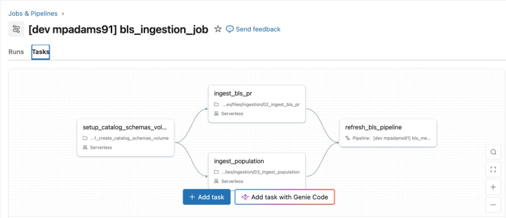
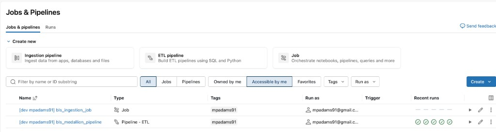

← [Back to guide index](README.md) · Previous: [Ingestion](02-ingestion.md) · Next: [The pipeline →](04-pipeline.md)

# Step 3: Deploying the Databricks Asset Bundle

**Goal:** package the setup notebook, ingestion notebooks, and the Lakeflow
pipeline into one versioned, repeatably-deployable unit, and deploy it.

## Why a bundle

Everything from [Step 1](01-setup.md) and [Step 2](02-ingestion.md), plus the
Lakeflow pipeline covered in [Step 4](04-pipeline.md), is defined as code in
`databricks.yml` and `resources/*.yml` — a **Databricks Asset Bundle (DAB)** —
rather than clicked together manually in the workspace UI. That means the
whole environment (catalog, schemas, volume, ingestion job, pipeline) can be
torn down and recreated identically, in `dev` or `prod`, from a clean
checkout.

## One-time setup: `contact_email`

The bundle's `contact_email` variable (used for the BLS `User-Agent` header —
see [Step 2](02-ingestion.md)) has no default, so it must be supplied before
deploying. Two gitignored options, so your email never gets committed:

**Option A — `.env` file:**

```bash
cp .env.example .env        # then edit .env and fill in your email
set -a && source .env && set +a
```

**Option B — `variable-overrides.json`** (no sourcing needed, read
automatically by the CLI):

```bash
mkdir -p .databricks/bundle/dev
cp variable-overrides.example.json .databricks/bundle/dev/variable-overrides.json
# then edit that file and fill in your email
```

## Deploying to `dev`

```bash
databricks bundle validate
databricks bundle deploy
databricks bundle run bls_ingestion_job
```

`bls_ingestion_job` runs `setup -> [ingest_bls_pr, ingest_population] ->
refresh_bls_pipeline` end to end — the last task triggers the Lakeflow
pipeline that builds Bronze, Silver, and Gold (see
[Step 4](04-pipeline.md)):



A successful deploy creates exactly two resources in **Jobs & Pipelines** —
the job and the pipeline defined in `resources/ingestion_job.yml` and
`resources/bls_pipeline.yml` respectively (name-prefixed with `[dev
<user>]` since this is the `dev` target):



## `dev` vs `prod`

`databricks.yml` defines two targets:

- **`dev`** (default) — `mode: development`, deploys a real synced copy of
  the files (not a live-working-tree reference) so its behavior matches
  what `prod` does.
- **`prod`** — `mode: production` and a dedicated non-user-scoped
  `workspace.root_path`.

To deploy to `prod`, copy `variable-overrides.example.json` to
`.databricks/bundle/prod/variable-overrides.json` instead of `dev`, then:

```bash
databricks bundle deploy -t prod
databricks bundle run bls_ingestion_job -t prod
```

Full details on both targets, and why each setting was chosen, are in the
root [`README.md`](../../README.md#targets-dev--prod).

## No schedule by default

Databricks Free Edition has a daily fair-usage quota, so `bls_ingestion_job`
isn't scheduled — re-run `databricks bundle run bls_ingestion_job` whenever
you want fresh data. See `resources/ingestion_job.yml` for how to add a
`trigger.periodic` block once you're ready to automate it.

---
← [Back to guide index](README.md) · Previous: [Ingestion](02-ingestion.md) · Next: [The pipeline →](04-pipeline.md)
