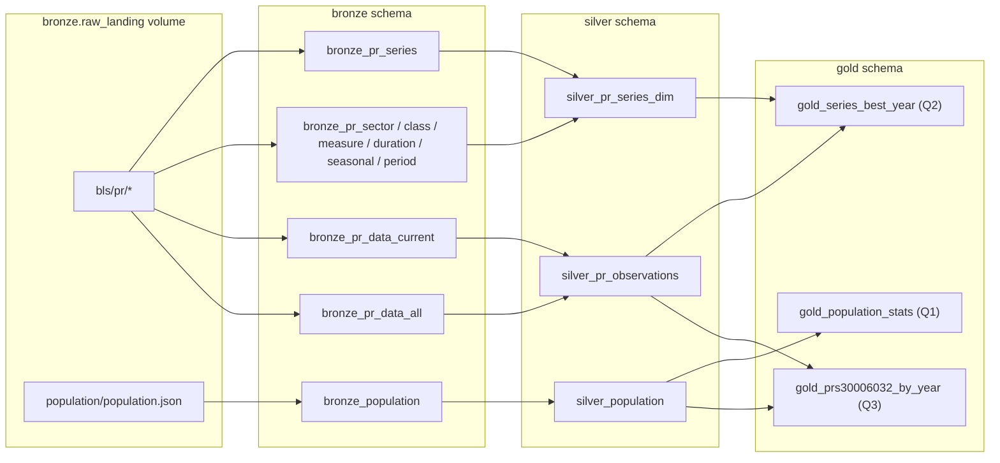
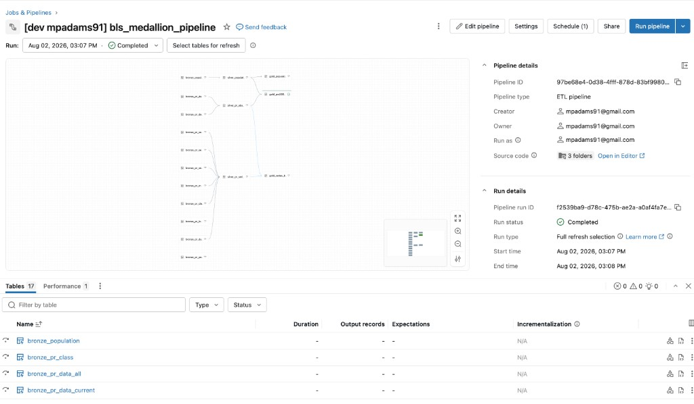

← [Back to guide index](README.md) · Previous: [Deploying the bundle](03-deploy-bundle.md) · Next: [Results →](05-results.md)

# Step 4: The Pipeline — Bronze, Silver, Gold

**Goal:** turn the raw files landed in [Step 2](02-ingestion.md) into three
clean, analysis-ready Gold tables, with data quality checks enforced along
the way.

## The DAG

`resources/bls_pipeline.yml` defines a single Lakeflow Declarative Pipeline
(serverless compute) that publishes across all three schemas:

Here's the same DAG as it renders in the Databricks workspace, once the
pipeline has run at least once:

<!-- SCREENSHOT: the pipeline's graph view (Workflows > Pipelines > bls_medallion_pipeline),
     ideally after a successful run so every node is green. -->

## Bronze: one materialized view per raw file

Each Bronze table reads its raw file against an explicit schema (not
inferred) and enforces a non-null-key expectation — see
`transformations/bronze/*.py`. Full column-by-column detail is in
[`docs/PIPELINE_PLAN.md`](../PIPELINE_PLAN.md#bronze-layer).

## Silver: cleaned, typed, deduplicated

- `silver_pr_series_dim` joins the code lookup tables into one
  human-readable `series_label` per series.
- `silver_pr_observations` unions the two BLS data files, casts types, and
  dedups on `(series_id, year, period)`.
- `silver_population` renames and types the population columns.

Full logic is in
[`docs/PIPELINE_PLAN.md`](../PIPELINE_PLAN.md#silver-layer).

## Gold: the three required answers

Covered in detail in [Step 5: Results](05-results.md).

## Data quality expectations

Enforced with Lakeflow expectations at every layer:

- **Expected schema** — every Bronze table reads against an explicit
  `StructType`.
- **Non-null keys** — `@dp.expect_or_drop` on key columns in Bronze and
  Silver (`series_id`/`year`/`period` for BLS, `nation_id`/`year`/
  `population` for population).

## Materialized views, not streaming tables

Every table in this pipeline is a materialized view (full batch recompute).
The raw files are small and get *overwritten in place* on every ingestion
run rather than appended, which doesn't fit Auto Loader's new-file-arrival
model — see
[`docs/PIPELINE_PLAN.md`](../PIPELINE_PLAN.md#documented-design-decisions--assumptions)
for the full reasoning.

## A practical gotcha: run the pipeline *after* ingestion has real data

Because these are materialized views, running the pipeline before Bronze has
any real Volume data to read (e.g. testing it manually before ingestion has
finished, or against an empty Volume) will "successfully" build empty Silver
and Gold tables — expectations report 100% pass because there's simply
nothing to violate. If that happens, a **Full Refresh** of the pipeline
forces every table to recompute against the current (now-populated) Bronze
tables and fixes it. This is exactly why `resources/ingestion_job.yml` chains
ingestion *before* the pipeline refresh task, rather than leaving them to run
independently.

---
← [Back to guide index](README.md) · Previous: [Deploying the bundle](03-deploy-bundle.md) · Next: [Results →](05-results.md)
