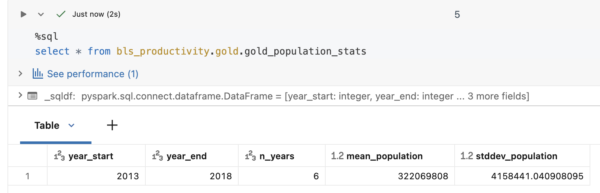
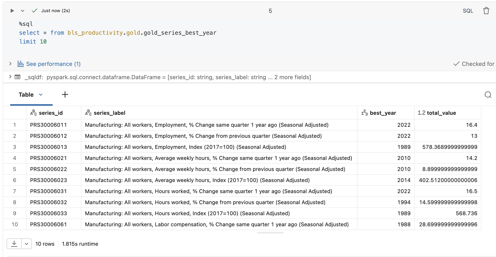
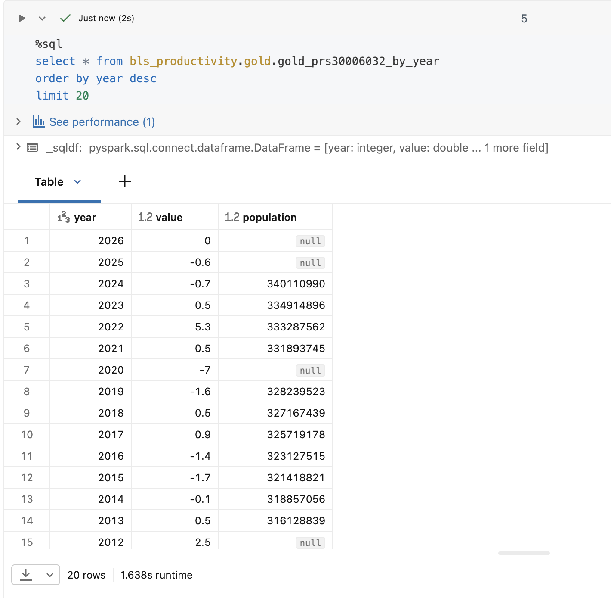

← [Back to guide index](README.md) · Previous: [The pipeline](04-pipeline.md) · Next: [Genie Agent →](06-genie.md)

# Step 5: Results — The Three Gold Answers

Each question is implemented once in SQL (`transformations/gold/*.sql`, the
primary implementation actually wired into the pipeline) and once in PySpark
(`transformations/gold_alternates/*.py`, functionally equivalent, kept out of
the pipeline's library glob on purpose — see
[its README](../../transformations/gold_alternates/README.md)).

## Q1: `gold_population_stats`

**Question:** what's the mean and standard deviation of the US population
between 2013 and 2018?

```sql
SELECT
  2013 AS year_start, 2018 AS year_end,
  AVG(population)    AS mean_population,
  STDDEV(population) AS stddev_population
FROM silver_population
WHERE nation = 'United States' AND year BETWEEN 2013 AND 2018;
```

Standard deviation uses the sample formula (`STDDEV`, Spark's default,
divide by N-1) — a convention choice, not derivable from the source data.

**Result:** mean population ≈ 322.1 million, standard deviation ≈ 4.2
million (population grew from 316.1M in 2013 to 327.2M in 2018, a 3.49%
increase) — also verified independently through the Genie Agent's own
generated SQL, see [Step 6](06-genie.md).


<!-- SCREENSHOT: query result / table preview for gold_population_stats. -->

## Q2: `gold_series_best_year`

**Question:** for every BLS series, which year had the largest total value
summed across its quarters?

```sql
WITH yearly_totals AS (
  SELECT series_id, year, SUM(value) AS total_value
  FROM silver_pr_observations
  WHERE period IN ('Q01','Q02','Q03','Q04')
  GROUP BY series_id, year
),
ranked AS (
  SELECT *, ROW_NUMBER() OVER (
    PARTITION BY series_id ORDER BY total_value DESC, year ASC
  ) AS rn
  FROM yearly_totals
)
SELECT r.series_id, d.series_label, r.year AS best_year, r.total_value
FROM ranked r JOIN silver_pr_series_dim d USING (series_id)
WHERE r.rn = 1;
```

`Q05` ("Annual Average," per BLS's own documentation) is deliberately
excluded from the sum — it's a separately computed aggregate, not a fifth
quarter, and including it would double-count each year's total. Each row
also carries a synthesized `series_label` (e.g. *"Manufacturing: All
workers, Hours worked, % Change from previous quarter (Seasonally
Adjusted)"*) instead of a bare code, for readability.

**Result:** 237 rows (one per `series_id`) - fewer than `bronze_pr_series`'s
283, because the join to `yearly_totals` is an inner join and some series
never have a `Q01`-`Q04` observation (only annual/`Q05` values, or no
observations at all), so they legitimately have no "best year" to report.


<!-- SCREENSHOT: query result / table preview for gold_series_best_year. -->

## Q3: `gold_prs30006032_by_year`

**Question:** how does series `PRS30006032` (Manufacturing, All workers,
Hours worked, % Change from previous quarter, Seasonally Adjusted) move
year over year, alongside US population?

```sql
SELECT o.year, o.value, p.population
FROM silver_pr_observations o
LEFT JOIN silver_population p ON o.year = p.year AND p.nation = 'United States'
WHERE o.series_id = 'PRS30006032' AND o.period = 'Q01'
ORDER BY o.year;
```

The join to population is a `LEFT JOIN`, not an inner join — BLS coverage
for this series starts in 1987, while population coverage is only
2013-2024 (minus a real 2020 gap, since the ACS didn't publish a 1-year
estimate that year). Most years legitimately have no matching population
value, and an inner join would silently drop them instead of showing that
gap.

**Result:** 39 rows (one per year), consistent with `PRS30006032`'s BLS
coverage running from 1987 through the most recent year in `pr.data.1.AllData`
/ `pr.data.0.Current`.


<!-- SCREENSHOT: query result / table preview for gold_prs30006032_by_year. -->

---
← [Back to guide index](README.md) · Previous: [The pipeline](04-pipeline.md) · Next: [Genie Agent →](06-genie.md)
