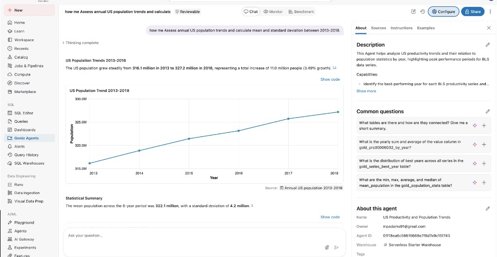

← [Back to guide index](README.md) · Previous: [Results](05-results.md)

# Step 6: Genie Agent — Self-Service Q&A for Non-Technical Stakeholders

**Goal:** let someone who doesn't write SQL ask questions in plain English
and get answers straight from the Gold layer.

## Why a Genie Agent (not a dashboard)

A dashboard is great for a fixed set of known questions, but a Genie Agent
lets a stakeholder ask *follow-up* questions ("what about just 2015-2017?")
without waiting on an engineer to add a new chart. Since the Gold layer here
is only three small, well-defined tables, it's a good fit: Genie only has to
reason over a handful of columns, not an entire warehouse.

## Creating the Genie Agent

1. In the Databricks workspace, go to **New → Genie** (or **Genie Agents** in
   the left sidebar → **Create**).
2. Give it a name, e.g. "BLS Productivity & Population."
3. Add the three Gold tables as its data source:
   `<catalog>.gold.gold_population_stats`,
   `<catalog>.gold.gold_series_best_year`,
   `<catalog>.gold.gold_prs30006032_by_year`.
4. Pick a SQL warehouse for it to query against (a small serverless warehouse
   is plenty for tables this size).

<!-- SCREENSHOT (optional): the Genie Agent creation screen with the three
     Gold tables added as data sources. -->

## Grounding it so answers are reliable

Genie's accuracy depends heavily on context you give it up front, not just
the raw schema:

- **Plain-text instructions** (in the agent's "Instructions" panel) — explain
  what each table means in a sentence or two, e.g.: *"gold_prs30006032_by_year
  has one row per year for the Manufacturing hours-worked series
  (PRS30006032, Q01/first-quarter values only); population is null for years
  outside 2013-2024 or the missing 2020 ACS gap — that's expected, not a data
  error."*
- **Example questions** (Genie's "Example queries" — you pair a natural
  question with the exact SQL it should map to). A few worth seeding:
  - *"What was the average US population from 2013 to 2018?"* →
    `SELECT mean_population FROM gold_population_stats;`
  - *"Which year had the highest total value for series X?"* →
    `SELECT best_year, total_value FROM gold_series_best_year WHERE series_id = 'X';`
  - *"Show me PRS30006032's value alongside population by year."* →
    `SELECT * FROM gold_prs30006032_by_year ORDER BY year;`
- **Column descriptions** — Unity Catalog column comments on the Gold tables
  (if added) get pulled in automatically as extra grounding context.
- **Common questions** (Genie's "About" panel, distinct from example
  queries — these are one-click suggestions shown to the stakeholder, no SQL
  attached). The deployed agent here ("US Productivity and Population
  Trends") is seeded with:
  - "What tables are there and how are they connected? Give me a short
    summary."
  - "What is the yearly sum and average of the value column in
    `gold_prs30006032_by_year`?"
  - "What is the distribution of best years across all series in the
    `gold_series_best_year` table?"
  - "What are the min, max, average, and median of `mean_population` in the
    `gold_population_stats` table?"

## Testing it

Ask it a few questions directly in the chat, including at least one it
wasn't explicitly seeded with, to confirm it generalizes rather than just
pattern-matching the example queries verbatim.

**This is the actual bonus deliverable in action** — a stakeholder with no
SQL knowledge typing a free-form question and getting a real, correct answer
straight from the Gold layer:

> *"how me Assess annual US population trends and calculate mean and
> standard deviation between 2013-2018."*

Genie wrote and ran its own SQL against `gold_population_stats`, then
returned a chart of the 2013-2018 trend, a one-line summary ("The US
population grew steadily from 316.1 million in 2013 to 327.2 million in
2018, representing a total increase of 11.0 million people (3.49% growth)"),
and the statistical summary itself: **mean population 322.1 million,
standard deviation 4.2 million** — the exact answer to Gold question 1,
produced without anyone writing a line of SQL.

## Sharing it

Use the **Share** button to grant the stakeholder(s) access — they don't
need any Databricks/SQL experience, just a workspace login.

## Version-controlling the Genie Agent

Genie Agents can be defined as a bundle resource
(`resources.genie_spaces` / `engine: direct` on newer CLI versions), which
would let its table list and instructions live in this repo alongside
everything else. This project keeps the Genie Agent as a manually-configured
workspace object rather than a bundle resource, since its instructions and
example queries are iterated on conversationally in the UI — if you want it
version-controlled, export its definition and add it as a
`resources/genie_*.yml` file following the same pattern as
`resources/bls_pipeline.yml`.

---
← [Back to guide index](README.md) · Previous: [Results](05-results.md)
