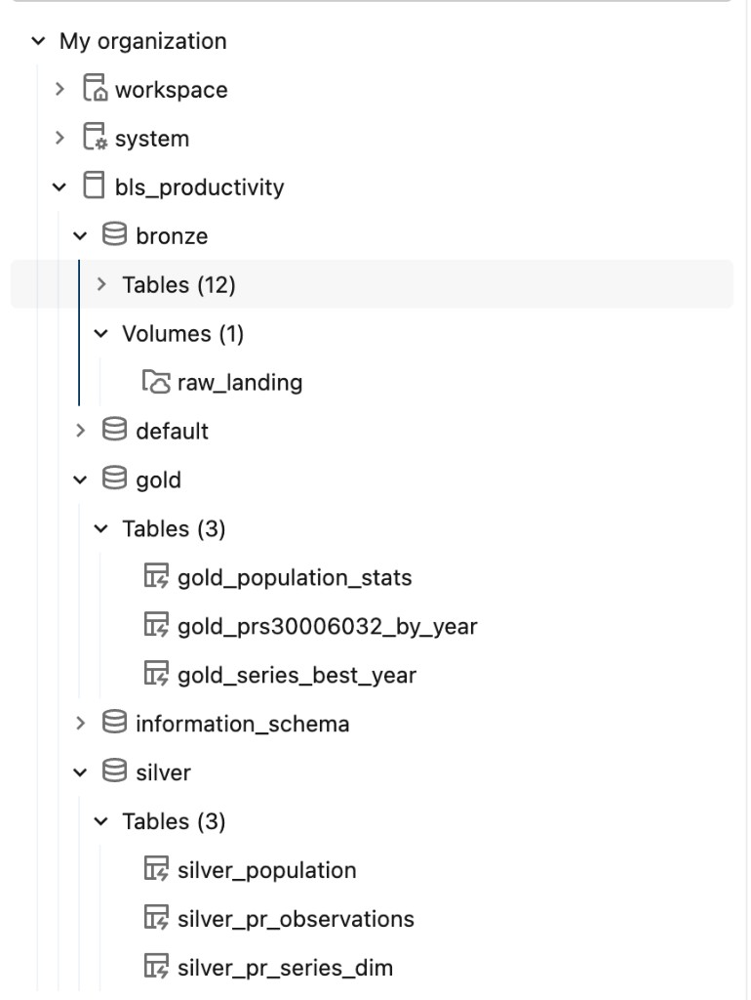

# BLS Productivity & Population Pipeline — Step-by-Step Guide

This is a narrated, step-by-step walkthrough of the whole project, meant to be
read top to bottom by someone seeing it for the first time. It's the "follow
along and see it work" companion to the two technical reference docs:

- [`README.md`](../../README.md) (repo root) — the "how to run it" reference:
  exact commands, parameters, and file-by-file structure.
- [`docs/PIPELINE_PLAN.md`](../PIPELINE_PLAN.md) — the "why" reference: every
  design decision and assumption, with the full SQL for each Gold table.

## What this project does

Two public data sources — [BLS productivity time-series data](https://download.bls.gov/pub/time.series/pr/)
and the [Data USA population API](https://honolulu-api.datausa.io/tesseract/data.jsonrecords?cube=acs_yg_total_population_1&drilldowns=Year%2CNation&locale=en&measures=Population) —
get ingested, cleaned, and combined into three specific analytical answers,
using a Databricks medallion architecture (Bronze → Silver → Gold), packaged
as a Databricks Asset Bundle, and finally made available to a non-technical
stakeholder through a Genie Agent.


<!-- SCREENSHOT: a screenshot of the Lakeflow pipeline's DAG/graph view in the
     Databricks workspace UI, showing the full Bronze -> Silver -> Gold graph. -->

## How to follow this guide

Each step below is its own page, in the order you'd actually run things:

1. [**Setup**](01-setup.md) — create the Unity Catalog catalog, schemas, and
   the raw-landing Volume.
2. [**Ingestion**](02-ingestion.md) — pull BLS and population data into the
   Volume, without re-downloading anything that hasn't changed.
3. [**Deploying the bundle**](03-deploy-bundle.md) — package everything as a
   Databricks Asset Bundle and deploy it to `dev` (or `prod`).
4. [**The pipeline**](04-pipeline.md) — how the Lakeflow Declarative Pipeline
   turns raw files into Bronze, Silver, and Gold tables, with data quality
   checks along the way.
5. [**Results**](05-results.md) — the three required answers, with the Gold
   table each one lives in.
6. [**Genie Agent**](06-genie.md) — a self-service, natural-language Q&A
   interface on top of the Gold layer for non-technical stakeholders.

## At a glance: Unity Catalog layout

```
<catalog>
├── bronze
│   ├── Volume: raw_landing            raw BLS files + population JSON
│   ├── Table: raw_ingestion_manifest  tracks what's been ingested, to skip unchanged files
│   └── bronze_pr_series, bronze_pr_sector/class/measure/duration/seasonal/period/footnote,
│       bronze_pr_data_current, bronze_pr_data_all, bronze_population
├── silver
│   └── silver_pr_series_dim, silver_pr_observations, silver_population
└── gold
    └── gold_population_stats, gold_series_best_year, gold_prs30006032_by_year
```

And here's what that looks like in Catalog Explorer once everything has run —
the `bronze`/`silver`/`gold` schemas, the `raw_landing` Volume, and all 18
tables:


